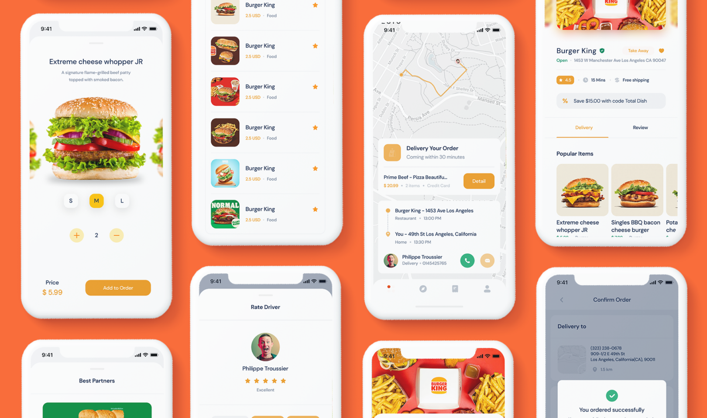

# 🍔 Food App – Expo + NativeWind

> **Author:** Nguyen Duc Minh Trung  
> **Website:** [minhtrung.site](https://minhtrung.site)

> **Website EC:** [ec.hoangminh.site](https://ec.hoangminh.site) <br/>
> **Website Admin:** [admin.artstack.online](https://admin.artstack.online)

---

## 📖 Overview

**Food App** is a cross-platform mobile application built with **Expo Router (React Native)** and **NativeWind (Tailwind CSS for RN)**.  
It demonstrates a modern, modular app structure including authentication, onboarding, and tab navigation — ideal for delivery or food ordering systems.

The user flow:

1. **Getting Started Intro** → slider of images with a **“Get Started”** button (shown only once).
2. **Authentication** → login or signup.
3. **Onboarding** → fill in **phone number** and **delivery address**.
4. **Main App Tabs** → Home, Search, Orders, and Profile.



### Shields Up!

<p align="center">
<!-- Popularity & community -->
<a href="https://github.com/minhtrung0110/food-app/stargazers">

</a>
<a href="https://github.com/minhtrung0110/food-app/network/members">

</a>
<a href="https://github.com/minhtrung0110/food-app/issues">

</a>
<a href="https://github.com/minhtrung0110/food-app/pulls">

</a>

<!-- Adoption & traffic (3rd‑party counters) -->


<!-- Code stats (optional) -->


</p>

---

## 🏗️ Tech Stack

- **Expo (React Native)** – cross-platform framework
- **Expo Router v6** – file-based navigation system
- **NativeWind (Tailwind v4)** – utility-first styling
- **TypeScript** – static typing
- **expo-secure-store** – token storage
- **@react-native-async-storage/async-storage** – onboarding & intro flags
- Optional: **@expo/vector-icons**, **TanStack Query**, **react-hook-form**, **zod**

---

## 📂 Folder Structure

```
📁 app/
│
├── _layout.tsx                  # Root provider + navigation guard
│
├── (intro)/
│   ├── _layout.tsx
│   └── getting-started.tsx      # Intro slider + Get Started
│
├── (auth)/
│   ├── _layout.tsx
│   ├── login.tsx
│   └── signup.tsx
│
├── (onboarding)/
│   ├── _layout.tsx
│   ├── phone.tsx
│   └── address.tsx
│
├── (tabs)/
│   ├── _layout.tsx
│   ├── index.tsx                # Home
│   ├── search.tsx               # Search
│   ├── orders.tsx               # Orders
│   └── profile.tsx              # Profile
│
└── +not-found.tsx

📁 components/
│   ├── Button.tsx
│   └── Input.tsx

📁 contexts/
│   └── session.tsx              # Session + Intro + Onboarding states

📁 assets/
│   └── intro/
│       ├── 1.png
│       ├── 2.png
│       └── 3.png

globals.css
tsconfig.json


```

---

## 🔐 Navigation Logic (Guard)

Centralized in `useAuthGuard()` inside `contexts/session.tsx`:

| State | Redirect To | Folder |
|--------|--------------|--------|
| First app open (`introDone = false`) | `/ (intro)/getting-started` | (intro) |
| No token | `/ (auth)/login` | (auth) |
| Logged in but not onboarded | `/ (onboarding)/phone` | (onboarding) |
| Logged in + onboarded | `/ (tabs)` | (tabs) |

---

## 🧭 Main Features

- ✅ **Intro Slider** – image carousel + dots + “Get Started” button
- 🔑 **Authentication** – Login & Signup flows
- 📱 **Onboarding** – Phone number & address form
- 🗺️ **Tabs Navigation** – Home, Search, Orders, Profile
- 🧭 **Guarded Routing** – Automatically redirects between sections
- 💾 **Secure Storage** – Token persisted with SecureStore
- 🌈 **Styled with Tailwind** – via NativeWind

---

## ⚙️ Getting Started

### 1. Install dependencies
```bash
yarn install
```

### 2. Run the app
```bash 

yarn start       # Open Expo DevTools
yarn android     # Run on Android
yarn ios         # Run on iOS (macOS only)
yarn web         # Preview on web

```

### 3. Environment variables (optional)

````
EXPO_PUBLIC_API_BASE_URL=https://api.example.com
````
Create a `.env` file in the root directory and add your environment variables as needed.

## 🧩 API Integration

Replace the fakeToken inside app/(auth)/login.tsx with a real backend login API.

Save the access token via SecureStore.

During onboarding (phone.tsx / address.tsx), call your backend profile API and then call completeOnboarding() to unlock main tabs.

## 🎨 Styling

Styled using NativeWind → Tailwind syntax in className.

Colors and spacing tokens defined in globals.css.

Example: 
````
<View className="flex-1 items-center justify-center bg-white">
  <Text className="text-xl font-semibold text-primary-500">Welcome to Food App</Text>
</View>
````
---
## 📦 Build & Deploy (optional)

To build production APK/IPA using EAS:
```
yarn expo login
yarn eas build -p android --profile production
yarn eas build -p ios --profile production
```
---
## 👤 Author

**Nguyen Duc Minh Trung**

Frontend Developer / Mobile Enthusiast

📍 Website: minhtrung.site

📞 0707624367

✉️ minhtrung4367@gmail.com

---
## 🪪 License

This project is private and intended for educational and portfolio purposes.
All rights reserved © 2025 Nguyen Duc Minh Trung.